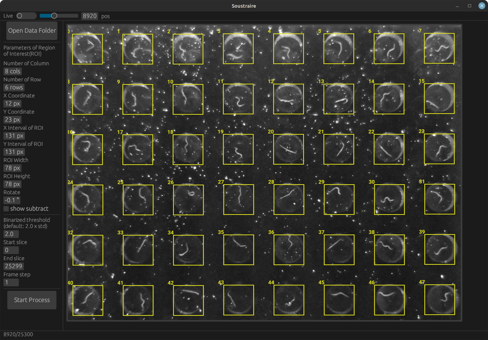

# Soustraire is a Rust implementation for Remi imagesubtractor.


## Overview


**Warning: This application did not support WASM.**

## How to install
### 1. Install [Rust](https://www.rust-lang.org/ja/tools/install)
- Windows
Downloaded the Rust installer from [Rust](https://www.rust-lang.org/ja/tools/install)
- MacOS/Linux
```shell
curl --proto '=https' --tlsv1.2 -sSf https://sh.rustup.rs | sh
```
### 2. Clone this repository [Soustraire](https://github.com/lycantrope/soustraire).

```shell
git clone https://github.com/lycantrope/soustraire
```
### 3. Run application
```shell
cargo run --release
```

### 4. [Optional] Build with SIMD optiomization supported by LLVM (Intel AVX2/AVX-512)

- MacOS/Linux
    ```bash
    RUSTFLAGS='-C target-feature=+avx' cargo build --release
    ```
- Windows  
  1. Set `RUSTFLAGS` to activate SIMD features. 
    ```powershell
    set RUSTFLAGS -C target-feature=+avx
    ```
  2. Build  
    ```powershell
    cargo build --release
    ```

###
## Algorithm

1. Delta = (previous image - current image) # calculate the difference from previous image 
2. Calculate the mean() and standard deviation(std) from delta.
4. Normalized the image ranging from -10.0×std to +10.0×std.
5. Binarized with threshold (n times std below mean, ex: 2.5×std represents 2.5×std below the mean value).
6. Count the numbers of pixels where value was 0. (The different part bewteen current and previous images).
